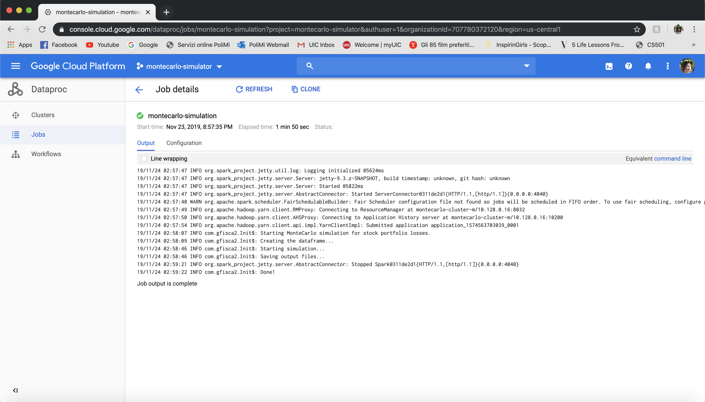

# CS441 - Engineering of Distributed Objects for Cloud Computing: homework 3
### Giorgia Fiscaletti, UIN: 669755907

## Introduction

The purpose of this homework was to develop a Spark program for parallel processing of the predictive engine for stock portfolio losses using Monte Carlo simulation in Spark.
This project is fully developed in Scala and can be compiled using SBT. The application can be deployed and run locally, on an Hortonworks Virtual Machine and on the Google Computing Engine (GCE).
 
## Instructions

### IntelliJ IDEA

### IntelliJ IDEA (to run the application locally on your machine)

- Open IntelliJ IDEA and select "Check out from Version Control" in the welcome screen
- Select "Git"
- Enter the repository URL (below), click on "Clone" and confirm when asked:
```
https://giorgiafiscaletti2@bitbucket.org/giorgiafiscaletti2/giorgia_fiscaletti_hw3.git
```
- A window for SBT import will appear: leave the default settings and confirm
- Go in /giorgia_fiscaletti_hw3/src/main/resources/config.conf and change local from 0 to 1
- Go in /giorgia_fiscaletti_hw3/src/main/scala/com/gfisca2 and run Init.scala

Otherwise:

- Open a terminal and type:
```
git clone https://giorgiafiscaletti2@bitbucket.org/giorgiafiscaletti2/giorgia_fiscaletti_hw3.git
```
- Open IntelliJ IDEA and select "Import project" in the welcome screen
- Select the project folder
- Choose "Import project from external model", select sbt and click on "Next"
- Leave the default SBT configuration and confirm
- Go in /giorgia_fiscaletti_hw3/src/main/resources/config.conf and change local from 0 to 1
- Go in /giorgia_fiscaletti_hw3/src/main/scala/com/gfisca2 and run Init.scala

### SBT CLI (to run the application locally on your machine)

- Open a terminal and type:
```
git clone https://giorgiafiscaletti2@bitbucket.org/giorgiafiscaletti2/giorgia_fiscaletti_hw3.git
```
- To run the tests, type the following command:
```
sbt clean compile test
```
- Go in /giorgia_fiscaletti_hw3/src/main/resources/config.conf and change local from 0 to 1
- To run the Monte Carlo simulation, type the following command:
```
sbt clean compile run
```

## Project Structure

As mentioned above, the project has been fully developed in Scala. A configuration file is provided for the main tasks and for the tests.

### Utils

There are two "utils" scala objects that were used to get the data needed for the computation.

#### DataFetcher and GetTickers

- *DataFetcher:* an object that provides the code to download the stock data from the Alpha Vantage.
- *GetTickers:* an object that retrieves the tickers list from the SP500 file.

### Portfolio

Portfolio is the most important class of the application. It defines the daily portfolios with all the information needed for
the simulations. 

#### Parameters:

- *id:* the id of the simulation to which the portfolio belongs;
- *date:* the date of the portfolio;
- *value:* the portfolio value based on the owned stocks;
- *cash:* the cash value;
- *owned:* a map containing the owned stocks, alongside their purchase date and the shares owned;
- *stocks:* the map containing all the stock values for a desired time period.

#### Methods: 

- *computeOwnedValue:* method that computes the portfolio value for a specific day, based on the owned stocks.
It collects the values of the owned stocks for the specific day from the stocks dataset, multiplying it with the 
value of shares owned (in the "owned" map). It then reduces the values in the list summing them up, and returns 
a tuple (day, value).
- *action:* one of the core operation of the Monte Carlo simulation, this method defines the single (and partially random) 
action to be done for each day in the given time period. Firstly, it checks if the stocks owned have reached a stop loss
value, or if their gain experienced a plateau in the time that elapsed from the day of the purchase and the current date
(this last check is simplified and just illustrative). If that is the case, the stock(s) is inserted in a list and is 
then sold. After the selling, the new cash value is computed. It was assumed that a new stock is bought for each stock sold
(e.g. if 2 stocks are sold, then the simulator will buy 2 stocks). The new cash is divided in equal parts depending on the
stocks to buy. Then, the new stocks are picked randomly from the stocks pool and the shares are computed depending on 
the amount of cash assigned to each new stock. Finally, the owned map, cash and value are updated and a the new portfolio
for the new day is created. If there is no stop loss or gain plateau, no action is performed, and the method returns a new
portfolio with just the updated value of the new day.
- *getDiff:* method to compute the percentage difference of the value of a given stock from the purchase date to
the given date.
- *getOwned:* getter method that returns the owned map.
- *getCsvLine:* method that builds a string in csv format that will be a line in the output file.

### Init

The object containing the main and the Spark Context. At the beginning of the main method, the Spark configuration, 
session and context are initialized. The "local" variable contained in the configuration file allows to eventually set the
master node to "local" if needed (i.e. if we want to run the application locally on our machine). A few lines of code are
dedicated to the preprocessing of the data, to build the csv file contained in res/processed from all the stocks data in 
the data directory. The preprocessing consists in building a dataset that shows, for each day and for each stock, the adjusted
close value. By setting the "prepr" variable in the configuration file to 1, the preprocessing can be skipped (it is 
set to 1 as default, since the processed csv file is ready). 
After the initialization of the Spark application and the (eventual) preprocessing, the dataset is filtered to select the
stock prices of a given time period (defined in the configuration file by "start" and "end"), and loaded to a dataframe. 
The dataframe is then converted into a Resilient Distributed Dataset (RDD), in order to allow parallel computations on it
with Spark. The RDD is then furtherly converted into a Map, where the key is a tuple (day, ticker) and the value is the
relative stock price of that company for the given day. With the call to sc.parallelize, the simulation starts. In this
example, 1000 Monte Carlo simulations are computed in parallel.

#### Methods:

- *initPortfolio:* method for portfolio initialization. Three well known stocks are selected from the pool (they are defined in the
configuration file, the user can change them as desired) and given as input to the simulation. For simplicity, we assume that 
the owned distinct stocks will always be three for the entire simulation, and that at the beginning we buy 1 share per stock. 
- *play:* the core method of the simulation. It represent a single Monte Carlo "game", i.e. a series of actions performed
in a given time period (a month in this example). Once the first portfolio is created with the input parameters, actions are
performed on the portfolio day by day and a new portfolio object is created for each day. The method collects all the portfolios
of a simulation in a list, and at the end it builds the csv "block" referring to the single simulation. The full output is built
in the main method putting together all the csv blocks resulted from the simulations with a flatMap.

### Tests

- TestUnits: a file to test some of the methods provided in the various map/reduce classes:
  
    - computeOwnedValue(): to check if the value of the owned stocks computed by the method is correct;
    - getDiff(): to check if the percentage difference of the values computed between two days is correct;
    - getOwned(): to check if the method returns the actual map of owned stocks;
    - getCsvLine(): to check if the csv lines built for the portfolios are correct;
    - action(): to check if the method works properly in case there are no stocks to sell.

### Configuration files

A simple configuration file config.conf is provided for the main tasks in order to have all the paths, filenames and other variables in the same file, allowing to change the values easily if needed.
Another configuration file is provided for the tests.

## Hortonworks Sandbox

The following steps illustrate how to run the code on the Hortonworks Sandbox, before moving to the AWS cloud. 
The Hortonworks Sandbox offer all the services needed to furtherly test the code locally, including Hadoop, YARN and HDFS filesystem.

### Set up

- First off, download an hypervisor (e.g. [VMWare](https://www.vmware.com/ "VMWare Homepage"))
- Download the [Hortonworks Sandbox](https://www.cloudera.com/downloads/hortonworks-sandbox.html), selecting Hortonworks HDP
- Set up the virtual machine (click [here](https://www.cloudera.com/tutorials/learning-the-ropes-of-the-hdp-sandbox.html) for the Cloudera tutorial)
- Once the set up is completed, you will see the following screen, showing the IP address for the welcome screen and SSH: 

- Git clone the repository following the same steps listed for the SBT CLI and go to the project root folder
- Assembly the project and generate the .jar file by typing:
```
sbt clean assembly
```

### Log in

- Copy the SSH IP address for your specific hypervisor and type:
```
ssh -p 2222 root@{HDP-IP-Address}
```
- The default password is **hadoop**, you will be required to change it after the first login

### Spark steps

- Upload the input folder (res) to the Hortonworks Sandbox via scp:
```
scp -P 2222 ${res_LOCAL_PATH} root@{HDP-IP-Address}:${res_REMOTE_PATH}
```
- Upload the input folder to the HDFS filesystem:
```
hdfs dfs -put ${res_REMOTE_PATH} res
```
- Upload the assembled .jar file to the Hortonworks Sandbox:
```
scp -P 2222 $JAR_PATH root@{HDP-IP-Address}:$JAR_REMOTE_PATH
```
- Run the Monte Carlo simulations:
```
spark-submit --deploy-mode cluster montecarlo.jar ${res_REMOTE_PATH} output_dir
```
Wait for the Spark application to complete execution...

To see the progress of the Spark application, follow the link that is printed to the terminal as soon as the computation starts.

### Get the results

- SSH to the Hortonworks Sandbox:
```
ssh -p 2222 root@{HDP-IP-Address}
```
- Merge and retrieve the results from the HDFS filesystem:
```
hdfs dfs -getmerge output_dir <local_output_filename>
```

Please note that to repeat the computation you need to remove the remote output directory. To do so, type:
```
hdfs dfs -rm -r output_dir
```

## GCE (Google Computing Engine) deployment

The steps on GCE are very similar to the ones for the Hortonworks Sandbox. 
All the instructions to set up a Google Cloud Project on GCE are provided [here](https://cloud.google.com/solutions/monte-carlo-methods-with-hadoop-spark).

The following steps illustrate how to deploy this Spark application on Google Cloud:

- Git clone the repository following the same steps listed for the SBT CLI and go to the project root folder
- Assembly the project and generate the .jar file by typing (in the project root folder):
```
sbt clean assembly
```
- Open the sidebar and go in Storage, select the bucket you created and upload the assembled .jar by clicking on "Upload files"
- Back in the sidebar, go in Compute Engine -> VM instances, and connect via SSH to the master node of the created cluster
by clicking on the SSH button of the VM instance named <cluster_name>-m. A terminal will appear in a separate window.
- Go in the project folder and zip the res directory
- Upload the zipped res folder to the cloud terminal by clicking on the gearwheel on the top right of the terminal window and 
selecting "Upload file"
- Unzip the res folder by typing:
```
unzip res.zip
```
- Move the res folder to the HDFS filesystem in the /user/root directory:
```
hdfs dfs -put res /user/root/
```
- Go back to the sidebar of the Google Cloud API, and select Dataproc -> Clusters
- Select the cluster
- Click on "Submit job" at the top of the webpage
- Give a name to the job (optional)
- Select the region (must be the region of your cluster) and the cluster
- Select "Spark" as job type
- In the "Main class or jar" field, type:
```
com.gfisca2.Init
```
- In the "Jar files" field, insert the path to your jar in the bucket, it should be:
```
gs://<bucket-name>/montecarlo.jar
```
- Click on "Submit"
- If you go in Dataproc -> Job you will be able to see the progress of the submitted job. If you wish to see the logs
during the execution, you can click on the job name.

This screenshot shows the log obtained after the completion of this Spark application:


To get the output:

- First, we need to merge the files and fetch them from HDFS. Go in the cloud terminal and type:
```
hdfs dfs -getmerge output_dir <local_output_filename>
```
- To download the file, click on the the gearwheel on the top right of the terminal window and select "Download file"
- Save the output file to the desired location and add the .csv extension.

## Results

The output file is a .csv file contained in the "results" folder (these results were computed on GCE). Each simulation is performed over March 2018. The first
element in the .csv line is the simulation id, in order to distinguish the simulations from each other. The second element
is the timestamp, i.e. the date in which the portfolio value was computed, and the third is the portfolio value itself.
As we can see scrolling down in the .cvs file, with the partial randomness of the Monte Carlo method the value of the portfolio
does not change significantly throughout the month (i.e. we do not experience significant gains nor losses).

## M/R and AWS ER

In order to exploit a full parallelization of the Monte Carlo simulations, this example was not thought as a map/reduce application.
As showed in the [Monte Carlo simulation example provided by Google](https://cloud.google.com/solutions/monte-carlo-methods-with-hadoop-spark#programming_a_monte_carlo_simulation_in_scala), all the simulation steps are run sequentially, while the
1000 different simulations are parallelized. The given usage of sc.parallelize does not allow the usage of distributed data inside the
simulation, so Spark is used upstream to preprocess the data and build the dataframe and to parallelize the simulations. 
 
To implement it as a map/reduce program, we would need to construct map/reduce tasks for each day, to collect all the values
of the owned stocks at the end of the day (as set of (day, value owned per stock) key-value pairs) tuples) and reduce them to 
a (day, total value) key-value pair. In order to parallelize the map/reduce tasks in this context, we would need to parallelize
the inner computations for each day (similar to what is done [here](https://runawayhorse001.github.io/LearningApacheSpark/mc.html), and since RDDs do not allow nested parallelization, we would not be able to parallelize the 
different simulations as well.
This leads to a significant slow-down in the execution time in a Spark application, that leads to the choice of the 
approach implemented in this work over the map/reduce structure. 

As mentioned above, if we wanted to implement this application in Hadoop, the map/reduce task would be reduced to a simple 
query to the dataframe to extract the stock value for a specific day, and the reducer would return the total portfolio
value for the specific day. The parallelization would involve the inner operations performed during the day.

Since the performance of the implemented approach is significantly better than that of the M/R approach, this last implementation is not furtherly
analyzed in this homework.